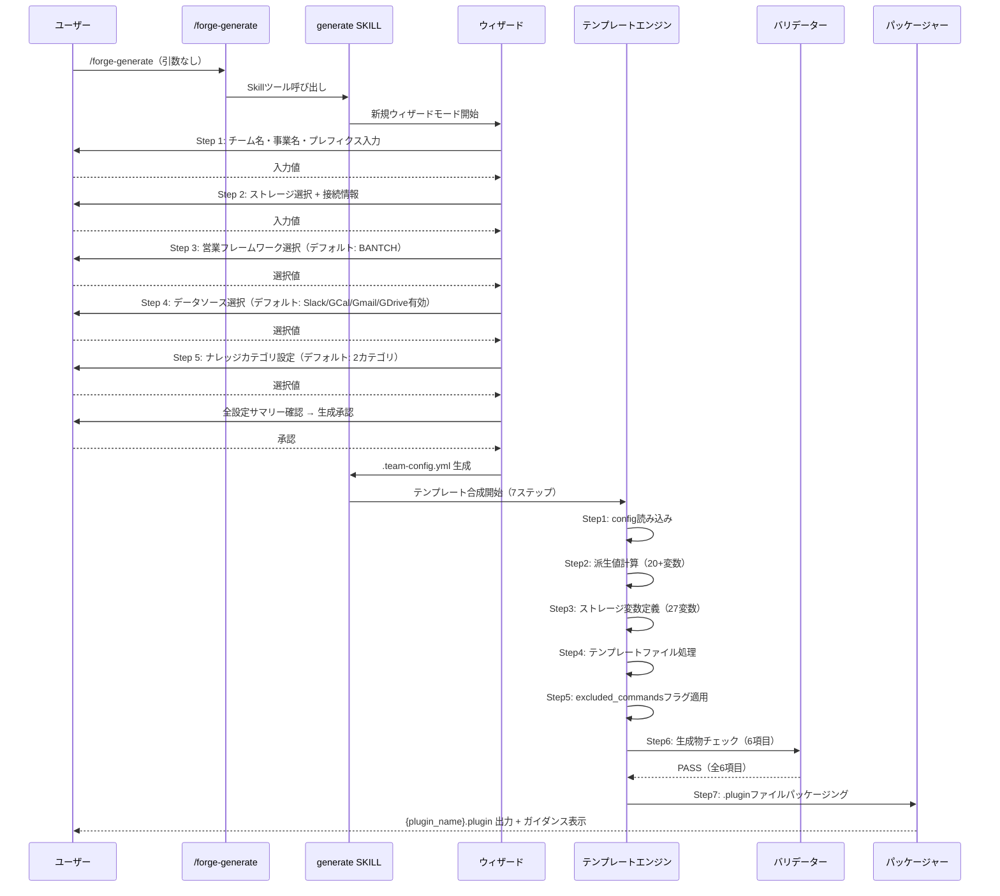
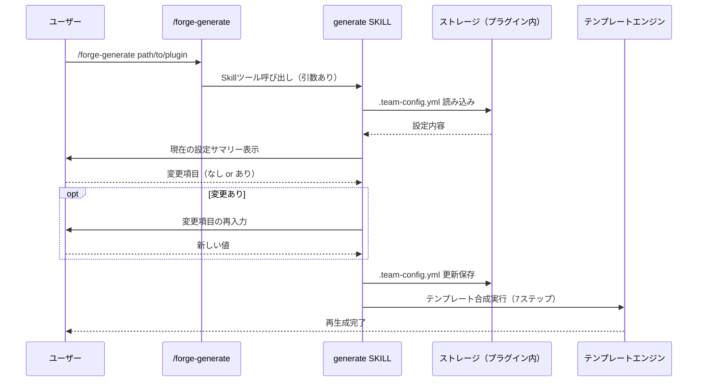
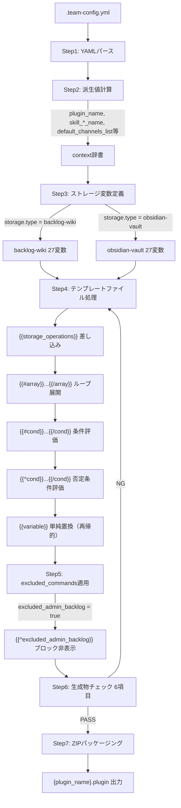
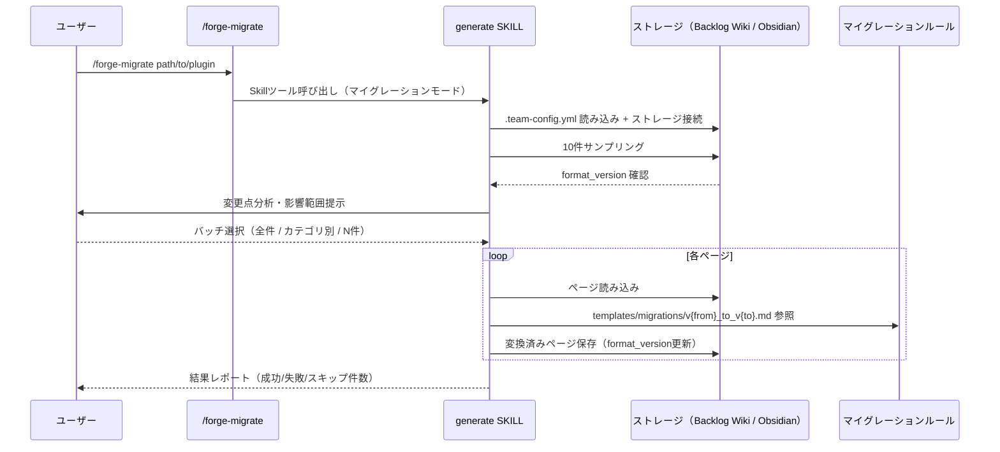
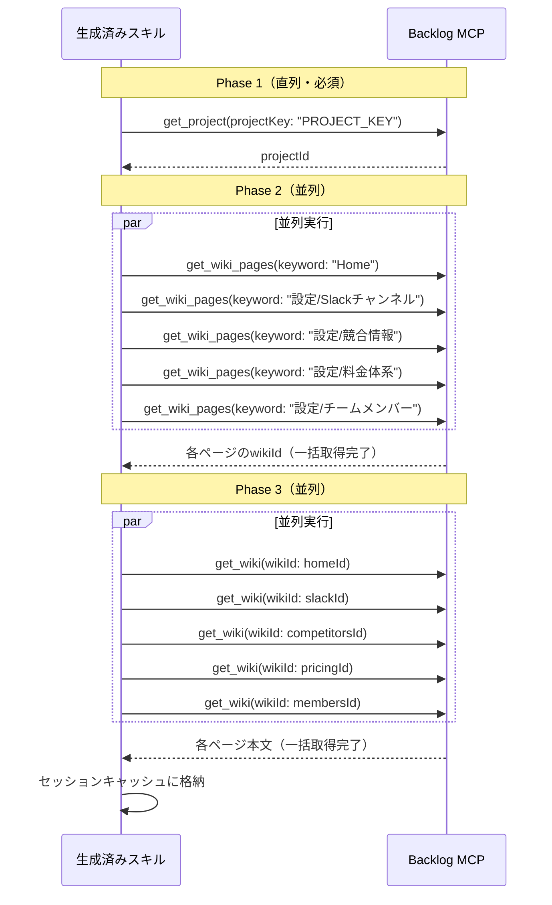
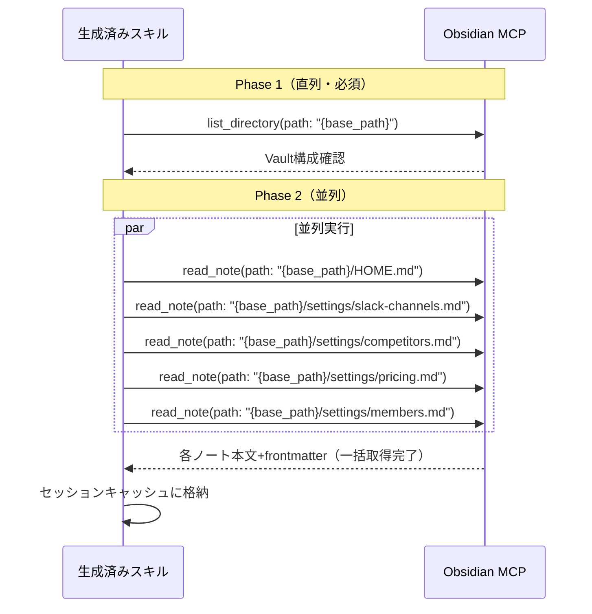
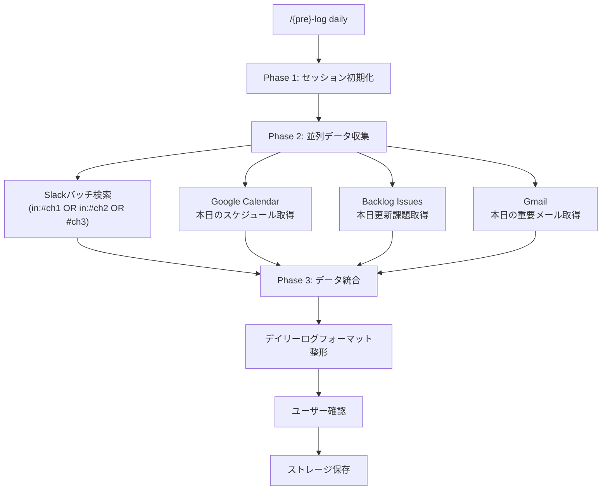
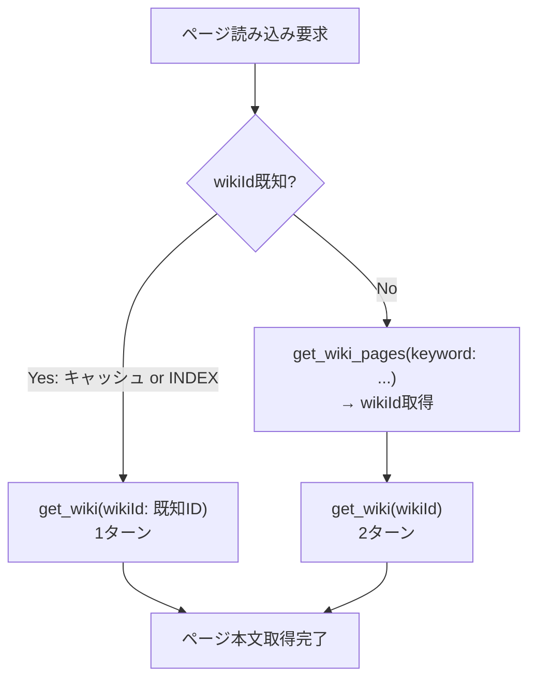
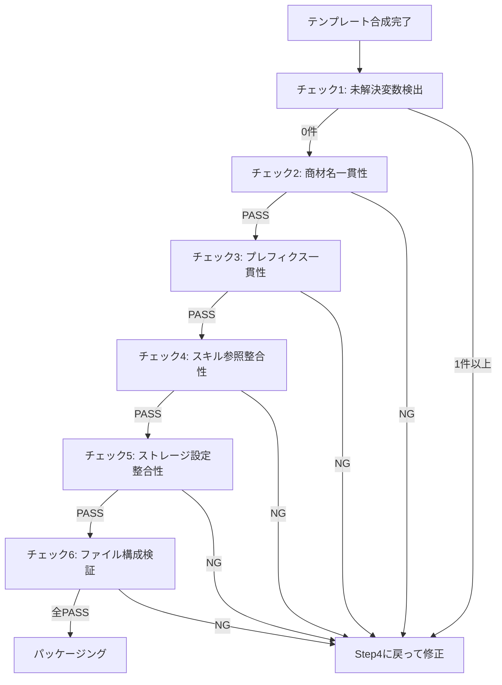

# データフロー図（逆生成）

## 分析日時
2026-03-07（更新: 2026-03-08、v0.8.0対応）

---

## 1. プラグイン生成フロー（新規）

---

## 2. プラグイン再生成フロー

---

## 3. テンプレート合成内部フロー（7ステップ詳細）

---

## 4. マイグレーションフロー

---

## 5. 生成されたプラグインのセッション初期化フロー（最適化A）

### Backlog Wiki（3-Phase）

### Obsidian Vault（2-Phase）

---

## 6. デイリーログデータ収集フロー（最適化B・E）

---

## 7. ストレージ読み書きフロー（wikiIdキャッシュ高速パス、最適化D）

---

## 8. バリデーションフロー（生成物チェック）

