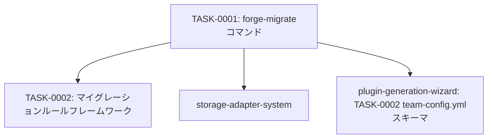

# data-migration タスク一覧

## 概要

**分析日時**: 2026-03-07
**対象コードベース**: /home/iridon0920/dev/context-stocker-forge/commands/ + templates/migrations/
**発見タスク数**: 2
**推定総工数**: 4h

生成済みプラグインのストレージデータをフォーマットバージョンアップに対応する機能。`/forge-migrate` コマンドと生成プラグイン内の `/{pre}-admin migrate` サブコマンドの2層構造。

## タスク一覧

#### TASK-0001: forge-migrateコマンド（フォーマットマイグレーション）

- [x] **タスク完了** (実装済み)
- **タスクタイプ**: DIRECT
- **実装ファイル**:
  - `commands/migrate.md`
  - `skills/generate/SKILL.md`（フォーマットマイグレーションセクション）
- **実装詳細**:
  - コマンド引数: 対象プラグインのパス
  - フロー: プラグイン内 `.team-config.yml` 読み込み → ストレージ接続 → 10件サンプリング → `format_version` 確認
  - 変更点分析・影響範囲提示（件数・推定処理量）
  - バッチ処理オプション: 全件一括 / カテゴリ別 / N件バッチ
  - 各ページ: 読み込み → `templates/migrations/` ルールで変換 → `format_version` 更新 → 保存
  - 結果レポート: 成功/失敗/スキップの件数
  - Skillツールで `context-stocker-forge:generate` スキルの「フォーマットマイグレーション」セクションを呼び出す
- **推定工数**: 2h

#### TASK-0002: マイグレーションルールフレームワーク

- [x] **タスク完了** (実装済み)
- **タスクタイプ**: DIRECT
- **実装ファイル**:
  - `templates/migrations/README.md`
- **実装詳細**:
  - ルールファイル命名規則: `v{from}_to_v{to}.md`（例: `v1_to_v2.md`）
  - ルールファイル構成: 変更概要 / 変換ルール（フィールド追加・削除・リネーム・構造変更）/ 検証条件
  - 現在は README.md のみ（バージョン1からの移行ルールは未作成）
  - `/{pre}-admin migrate` コマンド実行時に参照される
- **推定工数**: 2h

## 依存関係マップ

