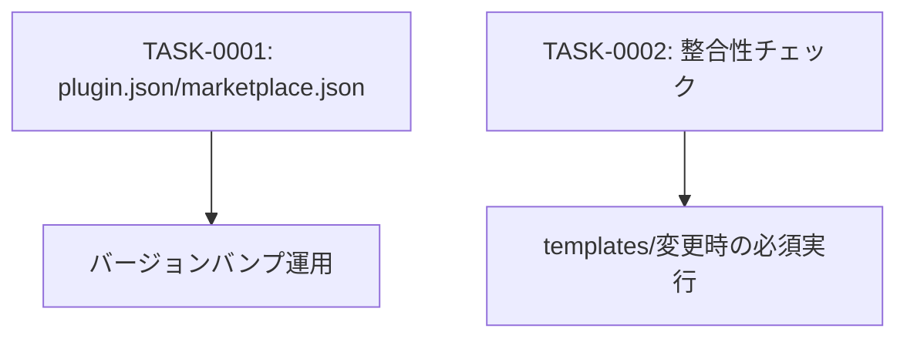

# forge-plugin-metadata タスク一覧

## 概要

**分析日時**: 2026-03-07
**対象コードベース**: /home/iridon0920/dev/context-stocker-forge/.claude-plugin/ + templates/
**発見タスク数**: 2
**推定総工数**: 3h

forgeプラグイン自身のメタデータ管理と、整合性チェックの仕組み。プラグインシステムへの登録情報（plugin.json, marketplace.json）と、テンプレート変更時の整合性保証ツールを含む。

## タスク一覧

#### TASK-0001: プラグインメタデータ（plugin.json / marketplace.json）

- [x] **タスク完了** (実装済み)
- **タスクタイプ**: DIRECT
- **実装ファイル**:
  - `.claude-plugin/plugin.json`
  - `.claude-plugin/marketplace.json`
- **実装詳細**:
  - `plugin.json`: name, version(0.8.0), description, author, keywords
  - `marketplace.json`: owner, metadata(description/version), plugins配列（name/source/description/version/author/license/keywords/category）
  - セマンティックバージョニング（0.x.x系）: マイナーはテンプレート構造変更、パッチは文言修正・バグ修正
  - 両ファイルのversionは常に同じ値を維持
  - コミットごとにバンプ、コミットメッセージは `v{version}: {変更概要}` 形式
- **推定工数**: 1h

#### TASK-0002: 整合性チェックツール（forge-consistency-check-prompt）

- [x] **タスク完了** (実装済み)
- **タスクタイプ**: DIRECT
- **実装ファイル**:
  - `templates/forge-consistency-check-prompt.md`
- **実装詳細**:
  - 10項目の整合性チェック定義
  - チェック1: コマンド→スキル呼び出しチェーン（参照セクション名の存在確認）
  - チェック2: 命名規則の一貫性（`{{product_prefix}}-deal` 統一）
  - チェック3: テンプレート変数の定義↔使用（config-schema/template-assembly/storage-adaptersでの定義確認）
  - チェック4: 出力パスマッピング（template-assembly.mdのマッピング表と実ファイルの一致）
  - チェック5: config-schema ↔ wizard-steps の対応
  - チェック6: plugin-json.template のスキル名・コマンド名と実ファイルの一致
  - チェック7: forge自体のcommands/ ↔ skills/ の参照整合性
  - チェック8: dealスキルの判断フローに記載されたコマンド名の存在確認
  - チェック9: スキル末尾のreferences一覧と実ファイルの一致
  - チェック10: `{{storage_*_cmd}}` 変数が両アダプタで定義されているか
  - CLAUDE.mdに「テンプレートファイル変更時の必須チェック」として実行条件を定義
- **推定工数**: 2h

## 依存関係マップ

