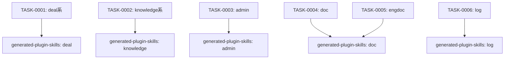

# generated-plugin-commands タスク一覧

## 概要

**分析日時**: 2026-03-07
**対象コードベース**: /home/iridon0920/dev/context-stocker-forge/templates/commands/
**発見タスク数**: 6
**推定総工数**: 10h

生成されるプラグインのコマンドテンプレート群。8種のコマンド（2個の独立ファイル + 6個のサブコマンドセット）を定義する。各コマンドはSkillツールで対応するスキルを呼び出す構造。

## タスク一覧

#### TASK-0001: deal系コマンド（load / save）

- [x] **タスク完了** (実装済み)
- **タスクタイプ**: DIRECT
- **実装ファイル**:
  - `templates/commands/deal/load.md.template`
  - `templates/commands/deal/save.md.template`
- **実装詳細**:
  - `{pre}-deal-load [顧客名]`: 案件コンテキストの復元。`{pre}-deal` スキルを呼び出し
  - `{pre}-deal-save`: 案件コンテキストの保存。`{pre}-deal` スキルを呼び出し
  - excluded_commandsでdeal-load / deal-saveはファイル単位でスキップ
- **推定工数**: 1.5h

#### TASK-0002: knowledge系コマンド（save / search）

- [x] **タスク完了** (実装済み)
- **タスクタイプ**: DIRECT
- **実装ファイル**:
  - `templates/commands/knowledge/save.md.template`
  - `templates/commands/knowledge/search.md.template`
- **実装詳細**:
  - `{pre}-knowledge-save`: ナレッジの保存。`{pre}-knowledge` スキルを呼び出し
  - `{pre}-knowledge-search [キーワード]`: ナレッジの検索。`{pre}-knowledge` スキルを呼び出し
  - excluded_commandsでknowledge-save / knowledge-searchはファイル単位でスキップ
- **推定工数**: 1.5h

#### TASK-0003: adminコマンド（11サブコマンド）

- [x] **タスク完了** (実装済み)
- **タスクタイプ**: DIRECT
- **実装ファイル**:
  - `templates/commands/admin.md.template`
- **実装詳細**:
  - 1ファイルに11サブコマンドのセクション: setup / index / slack / backlog / competitors / pricing / members / kpi-set / okr-set / stale / migrate
  - 各サブコマンドは `{{^excluded_admin_*}}` 条件ブロックで囲まれセクション単位除外
  - `{pre}-admin` スキルの対応セクションを呼び出す構造
- **推定工数**: 2h

#### TASK-0004: docコマンド（3サブコマンド）

- [x] **タスク完了** (実装済み)
- **タスクタイプ**: DIRECT
- **実装ファイル**:
  - `templates/commands/doc.md.template`
- **実装詳細**:
  - プリセールス文書生成: prep（事前調査）/ proposal（提案書）/ estimate（見積）
  - 各サブコマンドは `{{^excluded_doc_*}}` 条件ブロックでセクション単位除外
  - `{pre}-doc` スキルを呼び出す構造
- **推定工数**: 1.5h

#### TASK-0005: engdocコマンド（3サブコマンド）

- [x] **タスク完了** (実装済み)
- **タスクタイプ**: DIRECT
- **実装ファイル**:
  - `templates/commands/engdoc.md.template`
- **実装詳細**:
  - 導入支援文書生成: hearing（ヒアリングシート）/ config（設定確認書）/ testcases（テストケース）
  - 各サブコマンドは `{{^excluded_engdoc_*}}` 条件ブロックでセクション単位除外
  - `{pre}-doc` スキル（または専用スキル）を呼び出す構造
- **推定工数**: 1.5h

#### TASK-0006: logコマンド（3サブコマンド）

- [x] **タスク完了** (実装済み)
- **タスクタイプ**: DIRECT
- **実装ファイル**:
  - `templates/commands/log.md.template`
- **実装詳細**:
  - 活動ログ管理: daily（デイリーログ記録）/ weekly（週次レポート生成）/ report（レポート集約）
  - 各サブコマンドは `{{^excluded_log_*}}` 条件ブロックでセクション単位除外
  - `{pre}-log` スキルを呼び出す構造
- **推定工数**: 2h

## 依存関係マップ

