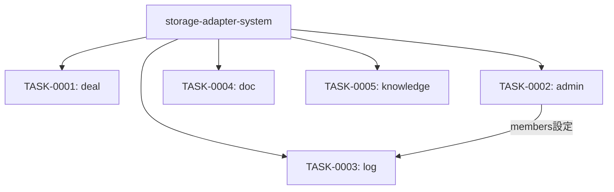

# generated-plugin-skills タスク一覧

## 概要

**分析日時**: 2026-03-07
**対象コードベース**: /home/iridon0920/dev/context-stocker-forge/templates/skills/
**発見タスク数**: 5
**推定総工数**: 18h

生成されるプラグインのスキルテンプレート群。5スキル（deal/admin/log/doc/knowledge）と各スキルのreferenceファイルテンプレートを定義する。各スキルはストレージアダプタの `{{storage_operations}}` を差し込む構造。

## タスク一覧

#### TASK-0001: dealスキル（案件コンテキスト管理）

- [x] **タスク完了** (実装済み)
- **タスクタイプ**: DIRECT
- **実装ファイル**:
  - `templates/skills/deal/SKILL.md.template`
  - `templates/skills/deal/references/context-format.md.template`
  - `templates/skills/deal/references/index-format.md.template`
  - `templates/skills/deal/references/similarity-check.md.template`
- **実装詳細**:
  - コンテキスト復元: ストレージから案件情報を読み込みセッションキャッシュに展開
  - コンテキスト保存: 営業フレームワーク（BANTCH/BANT/MEDDIC）フィールドを保存
  - 類似案件検索・推薦ロジック（similarity-check.md）
  - INDEXフォーマット定義（wikiId列含む、最適化D）
  - セッションキャッシュルール（最適化C）
  - コンテキストフォーマット定義（context-format.md）
  - `{{storage_operations}}` 差し込みによるストレージ操作定義
- **推定工数**: 5h

#### TASK-0002: adminスキル（管理操作）

- [x] **タスク完了** (実装済み)
- **タスクタイプ**: DIRECT
- **実装ファイル**:
  - `templates/skills/admin/SKILL.md.template`
  - `templates/skills/admin/references/index-format.md.template`
  - `templates/skills/admin/references/slack-channels-format.md.template`
  - `templates/skills/admin/references/backlog-projects-format.md.template`
  - `templates/skills/admin/references/competitors-format.md.template`
  - `templates/skills/admin/references/pricing-format.md.template`
  - `templates/skills/admin/references/team-members-format.md.template`
  - `templates/skills/admin/references/kpi-format.md.template`
  - `templates/skills/admin/references/okr-format.md.template`
- **実装詳細**:
  - setup: 未設定項目のチェックと設定ガイド表示
  - index: INDEXページ再構築（全ページ集計）
  - slack: Slackチャンネル設定ページの管理
  - backlog: Backlog監視プロジェクト設定ページの管理
  - competitors: 競合情報設定ページの管理
  - pricing: 料金体系設定ページの管理
  - members: チームメンバー設定ページの管理（`{{^excluded_admin_members}}` 対応）
  - kpi-set / okr-set: KPI・OKR設定ページの管理
  - stale: 鮮度切れページ検出（`{{#stale_thresholds}}` 定義値使用）
  - migrate: データフォーマットマイグレーション実行
  - 3-Phase初期化でセッションキャッシュを活用
- **推定工数**: 5h

#### TASK-0003: logスキル（活動ログ・レポート）

- [x] **タスク完了** (実装済み)
- **タスクタイプ**: DIRECT
- **実装ファイル**:
  - `templates/skills/log/SKILL.md.template`
  - `templates/skills/log/references/daily-log-format.md.template`
  - `templates/skills/log/references/weekly-report-format.md.template`
- **実装詳細**:
  - daily: 3-Phase並列データ収集（Slack/GCal/Backlog/Gmail）→ デイリーログ生成・保存（最適化B）
  - weekly: デイリーログ集約 + 重要度ティア（高/中/低）による絞り込み → 週次レポート生成
  - report: 週次レポートの階層型集約（週次→月次→四半期→年次）+ フォールバックロジック
  - Slackバッチ検索（`in:#ch1 OR in:#ch2` 形式）（最適化E）
  - チームメンバー別サマリー（`{{^excluded_admin_members}}` 条件ブロックで制御）
- **推定工数**: 4h

#### TASK-0004: docスキル（プリセールス・導入支援文書）

- [x] **タスク完了** (実装済み)
- **タスクタイプ**: DIRECT
- **実装ファイル**:
  - `templates/skills/doc/SKILL.md.template`
- **実装詳細**:
  - prep: 顧客事前調査レポート生成（Slack・Web・案件コンテキスト参照）
  - proposal: 提案書生成（営業フレームワーク・ナレッジ活用）
  - estimate: 見積書生成（料金体系・構成情報活用）
  - hearing: ヒアリングシート生成（engdocサブコマンド）
  - config: 設定確認書生成（engdocサブコマンド）
  - testcases: テストケース生成（engdocサブコマンド）
  - `{{storage_operations}}` 差し込みによるストレージ操作定義
- **推定工数**: 2h

#### TASK-0005: knowledgeスキル（ナレッジ管理）

- [x] **タスク完了** (実装済み)
- **タスクタイプ**: DIRECT
- **実装ファイル**:
  - `templates/skills/knowledge/SKILL.md.template`
  - `templates/skills/knowledge/references/knowledge-format.md.template`
- **実装詳細**:
  - ナレッジ保存: カテゴリ分類 + 重複チェック + ストレージ保存
  - ナレッジ検索: キーワード検索 + 類似ナレッジ推薦
  - knowledge_categories に基づくカテゴリ構造（`{{#knowledge_categories}}` ループ）
  - naレッジフォーマット定義（knowledge-format.md）
  - `{{storage_operations}}` 差し込みによるストレージ操作定義
- **推定工数**: 2h

## 依存関係マップ

