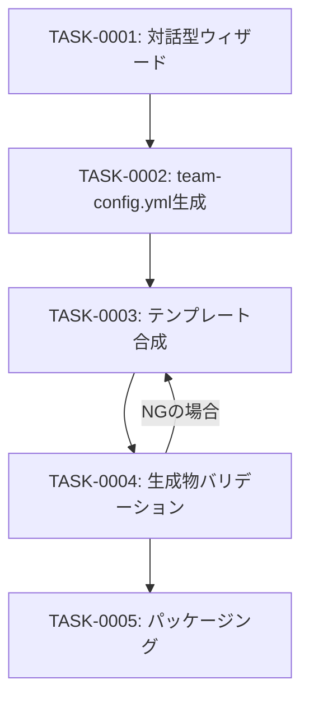

# plugin-generation-wizard タスク一覧

## 概要

**分析日時**: 2026-03-07
**対象コードベース**: /home/iridon0920/dev/context-stocker-forge
**発見タスク数**: 5
**推定総工数**: 18h

context-stocker-forgeのコアとなる機能。対話型ウィザードでチーム情報をヒアリングし、`.team-config.yml` を生成してからテンプレート合成・バリデーション・パッケージングまでの一連フローを実現する。

## タスク一覧

#### TASK-0001: 対話型ウィザード（5ステップ+確認）

- [x] **タスク完了** (実装済み)
- **タスクタイプ**: DIRECT
- **実装ファイル**:
  - `skills/generate/SKILL.md`
  - `skills/generate/references/wizard-steps.md`
  - `commands/generate.md`
- **実装詳細**:
  - Step 1: チーム名・事業名・コマンドプレフィクスのヒアリング（自動提案ロジック含む）
  - Step 2: ストレージ種別選択（backlog-wiki / obsidian-vault）+ 接続情報入力
  - Step 3: 営業フレームワーク選択（BANTCH/BANT/MEDDIC/カスタム、デフォルト: BANTCH）
  - Step 4: データソース選択（Slack/Calendar/Gmail/Drive/Backlog Issues、デフォルト: 全有効）
  - Step 5: ナレッジカテゴリ選択（必須カテゴリ+任意追加、デフォルトあり）
  - 確認ステップ: 全設定一覧の表示 → 生成承認
  - Step 1-2は必須、Step 3-5はデフォルト値あり（スキップ可）
  - AskUserQuestionツールを活用した選択式プロセス
  - モード判定: 引数なし（新規）/ 引数あり（再生成）/ migrateコマンドから（マイグレーション）
- **推定工数**: 6h

#### TASK-0002: .team-config.yml スキーマと生成

- [x] **タスク完了** (実装済み)
- **タスクタイプ**: DIRECT
- **実装ファイル**:
  - `skills/generate/references/config-schema.md`
- **実装詳細**:
  - トップレベルフィールド定義（product_name, product_prefix, team_name, storage, knowledge_categories, sales_framework, data_sources, excluded_commands等）
  - storageオブジェクト（backlog_wiki / obsidian_vault 分岐）
  - 組み込み営業フレームワーク定義（BANTCH, BANT, MEDDIC）
  - KPI設定スキーマ（revenue_categories）
  - data_sources設定（Slack, Google Calendar, Gmail, Google Drive, Backlog Issues）
  - excluded_commandsによるコマンド除外機能
- **推定工数**: 3h

#### TASK-0003: テンプレート合成（7ステップ）

- [x] **タスク完了** (実装済み)
- **タスクタイプ**: DIRECT
- **実装ファイル**:
  - `skills/generate/references/template-assembly.md`
  - `skills/generate/SKILL.md`
- **実装詳細**:
  - Mustache風テンプレート変数記法（単純置換・配列ループ・条件ブロック）
  - 変数マッピング5カテゴリ（config直接・派生値・ストレージ個別・配列ループ・条件ブロック）
  - 派生値の自動計算（plugin_name, skill_*_name, skill_reference, default_channels_list等 20+変数）
  - ストレージ操作差し込み（`{{storage_operations}}`）後の再帰的変数解決
  - excluded_commandsから `excluded_*` フラグ変数の自動生成
  - 合成後ファイル名マッピング（テンプレートパス → 出力パス）
- **推定工数**: 4h

#### TASK-0004: 生成物バリデーション（6項目チェック）

- [x] **タスク完了** (実装済み)
- **タスクタイプ**: DIRECT
- **実装ファイル**:
  - `skills/generate/references/post-generation-check.md`
- **実装詳細**:
  - チェック1: 未解決テンプレート変数の検出（`{{...}}`パターン残存確認）
  - チェック2: 商材名の一貫性（他商材名の混入確認）
  - チェック3: コマンドプレフィクスの一貫性
  - チェック4: スキル参照の整合性（plugin_name・スキル名）
  - チェック5: ストレージ設定の整合性
  - チェック6: ファイル構成の検証（必須ファイル・除外セクション）
  - NGの場合Step 4（テンプレート合成）に戻ってリトライ
- **推定工数**: 2h

#### TASK-0005: .pluginファイルパッケージングと生成後ガイダンス

- [x] **タスク完了** (実装済み)
- **タスクタイプ**: DIRECT
- **実装ファイル**:
  - `skills/generate/SKILL.md`
- **実装詳細**:
  - ZIPアーカイブとしてパッケージング（`cd {plugin_name} && zip -r ../{plugin_name}.plugin .`）
  - ZIPルート直下に `.claude-plugin/plugin.json` が存在する構造（ラッパーディレクトリ禁止）
  - 出力先をユーザーに確認（デフォルト: カレントディレクトリ）
  - 生成後ガイダンス: インストール方法・初回セットアップコマンド（`/{pre}-admin setup`）・設定ファイル同梱の案内
- **推定工数**: 3h

## 依存関係マップ

