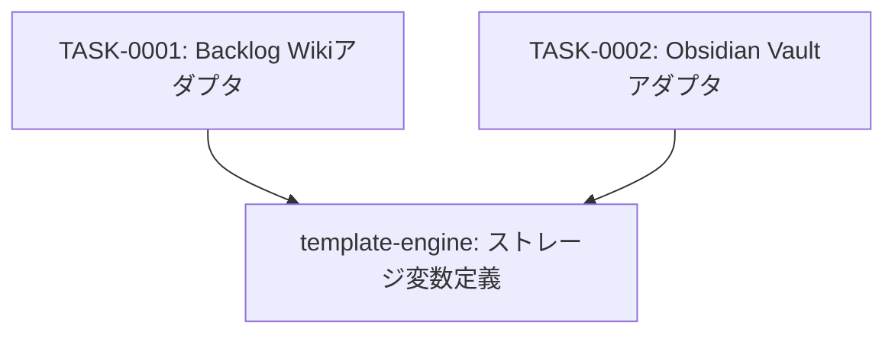

# storage-adapter-system タスク一覧

## 概要

**分析日時**: 2026-03-07
**対象コードベース**: /home/iridon0920/dev/context-stocker-forge/storage-adapters/
**発見タスク数**: 2
**推定総工数**: 6h

生成されるプラグインのストレージ抽象化レイヤー。Backlog WikiとObsidian Vaultの2種類のアダプタを定義し、テンプレート合成時に差し込まれる。各アダプタは27の変数契約を満たす必要がある。

## タスク一覧

#### TASK-0001: Backlog Wikiアダプタ

- [x] **タスク完了** (実装済み)
- **タスクタイプ**: DIRECT
- **実装ファイル**:
  - `storage-adapters/backlog-wiki.md`
- **実装詳細**:
  - Backlog MCP（`mcp__backlog__`）経由のWikiページ管理
  - ページ作成（`add_wiki`）/ 読み込み（`get_wiki_pages` → `get_wiki`）/ 更新（`update_wiki`）/ 検索（`get_wiki_pages(keyword:)`）
  - wikiIdメタデータキャッシュによる高速パス（`get_wiki_pages`スキップ）（最適化D）
  - 3-Phase初期化: Phase1（`get_project`直列）→ Phase2（設定ページwikiId並列取得）→ Phase3（本文並列取得）（最適化A）
  - ページパス命名規則: `案件/{顧客名}/{案件名}`, `ナレッジ/{カテゴリ名}/{ページ名}`, `活動ログ/{YYYY-MM}/{YYYY-MM-DD}`
  - 書き込み確認プロトコル（全書き込み操作前にユーザー承認）
  - 27変数の変数契約定義
- **推定工数**: 3h

#### TASK-0002: Obsidian Vaultアダプタ

- [x] **タスク完了** (実装済み)
- **タスクタイプ**: DIRECT
- **実装ファイル**:
  - `storage-adapters/obsidian-vault.md`
- **実装詳細**:
  - Obsidian MCP（`mcp__obsidian__`）経由のVaultノート管理
  - ノート作成（`write_note`）/ 読み込み（`read_note`）/ 部分更新（`patch_note`）/ 全体更新（`write_note(mode: overwrite)`）/ 検索（`search_notes`）
  - Frontmatter管理（`update_frontmatter`）によるメタデータ追跡
  - 2-Phase初期化: Phase1（`list_directory`直列）→ Phase2（設定ノート並列読み込み）（最適化A）
  - ディレクトリ構造: `{base_path}/deals/`, `knowledge/`, `logs/`, `settings/`, `guidelines/`, `HOME.md`
  - ファイルパス命名規則（backlog-wikiと対応する構造）
  - 書き込み確認プロトコル（全書き込み操作前にユーザー承認）
  - 27変数の変数契約定義（backlog-wikiと同一インターフェース）
- **推定工数**: 3h

## 依存関係マップ

